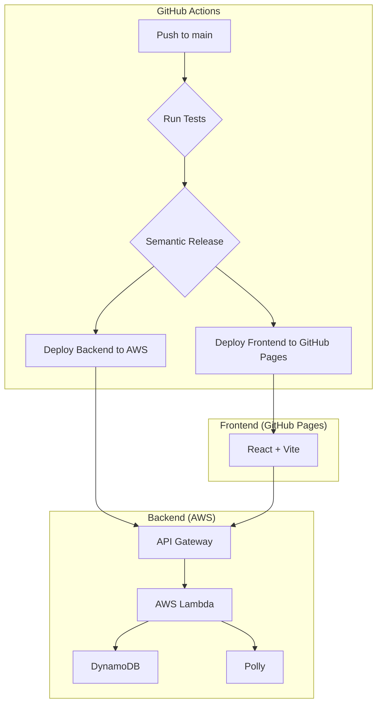

# karuta
かるた読み上げアプリ

## Features

- **フレーズ読み上げ**:
  - 指定されたカテゴリのフレーズをランダムに取得し、Amazon Pollyを利用して音声を生成します。
  - 英語と日本語に対応しており、読み上げ速度の調整が可能です。
  - 読み上げ回数や平均タイム、平均難易度を記録します。
- **カテゴリ管理**:
  - 登録されているフレーズのカテゴリを一覧で取得します。
- **コメント機能**:
  - 各フレーズに対してコメントを投稿し、表示することができます。
- **お祝いメッセージ**:
  - 全てのフレーズを読み終えると、お祝いのメッセージが音声で再生されます。
- **フレーズ一覧**:
  - 登録されているフレーズを一覧で確認できます。

## Architecture

