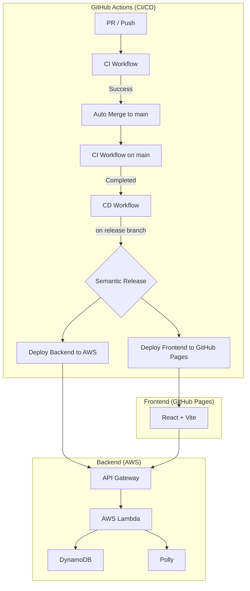

# karuta
かるた読み上げアプリ

## Features

- **フレーズ読み上げ**:
  - 指定されたカテゴリのフレーズをランダムに取得し、Amazon Pollyを利用して音声を生成します。
  - 英語と日本語に対応しており、読み上げ速度の調整が可能です。
  - 読み上げ回数や平均タイム、平均難易度を記録します。
- **カテゴリ管理**:
  - 登録されているフレーズのカテゴリを一覧で取得します。
- **コメント機能**:
  - 各フレーズに対してコメントを投稿し、表示することができます。
- **お祝いメッセージ**:
  - 全てのフレーズを読み終えると、お祝いのメッセージが音声で再生されます。
- **フレーズ一覧**:
  - 登録されているフレーズを一覧で確認できます。

## Architecture

## CI/CD Pipeline Specification

本プロジェクトでは GitHub Actions を利用して CI/CD パイプラインを構築しています。

### 1. CI ワークフロー (`ci.yml`)
- **トリガー**:
  - `main` または `release` ブランチへのプッシュ
  - 全てのプルリクエスト
- **実行内容**:
  - `commitlint`: コミットメッセージが Conventional Commits 形式に従っているか検証
  - `frontend-test`: フロントエンドの Lint、ビルド、および Vitest によるテスト
  - `backend-test`: バックエンドの Vitest によるテスト
  - `merge`: PR の場合、テスト成功後に `main` ブランチへ自動マージ（Squash merge）

### 2. CD ワークフロー (`cd.yml`)
- **トリガー**:
  - `main` または `release` ブランチへのプッシュ
  - CI ワークフローの成功完了（`workflow_run`）
- **実行内容**:
  - `release`: `semantic-release` によるバージョン自動採番、タグ付け、および `CHANGELOG.md` の更新
  - `build-and-deploy-frontend`: フロントエンドをビルドし、GitHub Pages へデプロイ
  - `deploy-backend`: バックエンドを Serverless Framework を使用して AWS Lambda へデプロイ

### 3. リリース運用
- **リリース条件**:
  - `semantic-release` による実際のタグ付けとデプロイは、**`release` ブランチへのマージ（プッシュ）時にのみ**実行されます。
  - `main` ブランチは開発用であり、保護設定による権限エラーを避けるため、自動リリースはスキップされます。
- **リリースの手順**:
  1. 通常の開発は `main` ブランチに対して行い、PR を作成してマージします。
  2. リリースの準備ができたら、`main` ブランチを `release` ブランチにマージします。
  3. `release` ブランチでの CI 成功後、自動的にリリースおよびデプロイが行われます。

