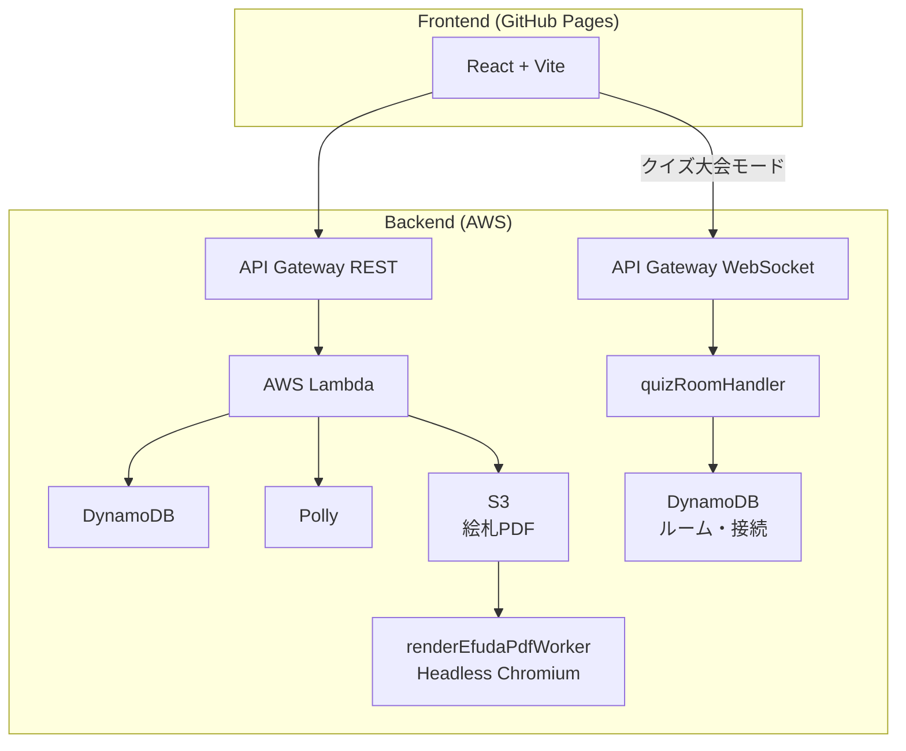
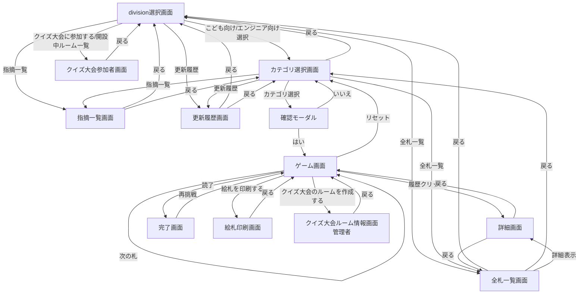

# 名称
かるた読み上げアプリ

## 目的
かるたの読み上げをアプリで行うことで、全員がかるたに参加すること。

## Features

- **フレーズ読み上げ**:
  - 指定されたカテゴリのフレーズをランダムに取得し、Amazon Pollyを利用して音声を生成します。
  - 英語と日本語に対応しており、読み上げ速度の調整が可能です。
  - 読み上げ回数や平均タイム、平均難易度を記録します。
- **カテゴリ管理**:
  - 登録されているフレーズのカテゴリを一覧で取得します。
- **コメント機能**:
  - 各フレーズに対してコメントを投稿し、表示することができます。
- **お祝いメッセージ**:
  - 全てのフレーズを読み終えると、お祝いのメッセージが音声で再生されます。
- **フレーズ一覧**:
  - 登録されているフレーズを一覧で確認できます。
- **クイズ大会モード**:
  - 管理者がルームを開設し、ルームコードまたはQRコードで参加者を招待できます。
  - WebSocketにより、読み札・結果画面が管理者・参加者間でリアルタイムに同期されます（読み上げ音声は参加者の端末でも再生されます）。
  - 早押しに対応しており、最初に回答した参加者だけが確定し、管理者が正誤を判定します。
  - 正誤判定に応じてポイントが集計され、参加者一覧とあわせて表示されます。

## Tech Stack

| 技術 | 名称 | 説明 |
| :---: | :--- | :--- |
|  | **React** | ユーザーインターフェース構築のためのJavaScriptライブラリ。最新のv19を使用。 |
|  | **Vite** | 高速なビルドツールおよび開発サーバー。 |
|  | **DynamoDB** | フルマネージドなNoSQLデータベース。フレーズや統計情報を格納。 |
|  | **AWS Lambda** | サーバーレスなイベント駆動型コンピューティングサービス。 |
|  | **Serverless Framework** | サーバーレスアプリケーションの構成・デプロイを管理するフレームワーク。デプロイCLIはSaaSサインイン不要なOSSフォーク[osls](https://github.com/oss-serverless/serverless)を使用（issue #611）。 |
|  | **Amazon Polly** | テキストをリアルな音声に変換するクラウドサービス。 |
|  | **GitHub Actions** | CI/CD（継続的インテグレーション/継続的デプロイ）を自動化。 |
|  | **Vitest** | Viteネイティブで高速なユニットテストフレームワーク。 |
|  | **API Gateway (WebSocket)** | クイズ大会モードの読み札・結果・早押し等をリアルタイムに同期するWebSocket API。 |
| - | **qrcode** | クイズ大会モードの参加用招待URLをQRコード化するJavaScriptライブラリ。 |

## Architecture

### System Architecture

<details>
<summary>ソースを表示（mermaid記法）</summary>


```mermaid
graph TD
    subgraph "Frontend (GitHub Pages)"
        I[React + Vite]
    end

    subgraph "Backend (AWS)"
        J[API Gateway REST] --> K[AWS Lambda];
        K --> L[DynamoDB];
        K --> M[Polly];
        K --> N[S3<br/>絵札PDF];
        N --> O[renderEfudaPdfWorker<br/>Headless Chromium];

        P[API Gateway WebSocket] --> Q[quizRoomHandler];
        Q --> R[DynamoDB<br/>ルーム・接続];
    end

    I --> J;
    I -->|クイズ大会モード| P;
```

上記の```mermaid```ブロックはPR差分ビュー・API経由でのファイル取得等ではテキストのまま表示され図として確認できない（[#824](https://github.com/bamiyanapp/karuta/issues/824)）。ソースはこのまま維持しつつ、下記は`enable_mermaid_render` job（[docs/cicd-pipeline-specification.md](./docs/cicd-pipeline-specification.md)参照）が`main`へのマージのたびに再レンダリングし、`docs-diagrams`ブランチの`latest/`へ上書き公開している画像（常に最新版）。

</details>


### Screen Transitions

<details>
<summary>ソースを表示（mermaid記法）</summary>


```mermaid
graph TD
    Z[division選択画面] -->|こども向け/エンジニア向け選択| A[カテゴリ選択画面]
    Z -->|全札一覧| D[全札一覧画面]
    Z -->|指摘一覧| E[指摘一覧画面]
    Z -->|更新履歴| F[更新履歴画面]
    Z -->|クイズ大会に参加する/開設中ルーム一覧| J[クイズ大会参加者画面]

    A -->|戻る| Z
    A -->|カテゴリ選択| B[確認モーダル]
    B -->|はい| C[ゲーム画面]
    B -->|いいえ| A
    
    A -->|全札一覧| D
    A -->|指摘一覧| E
    A -->|更新履歴| F
    
    C -->|次の札| C
    C -->|履歴クリック| G[詳細画面]
    C -->|読了| H[完了画面]
    C -->|リセット| A
    C -->|絵札を印刷する| I[絵札印刷画面]
    C -->|クイズ大会のルームを作成する| K[クイズ大会ルーム情報画面<br/>管理者]
    
    D -->|戻る| Z
    D -->|戻る| A
    D -->|詳細表示| G
    
    E -->|戻る| Z
    E -->|戻る| A
    
    F -->|戻る| Z
    F -->|戻る| A
    
    G -->|戻る| C
    G -->|戻る| D
    
    H -->|再挑戦| C

    I -->|戻る| C

    K -->|戻る| C

    J -->|戻る| Z
```

同様に、上記図もCIが再レンダリングし`docs-diagrams`ブランチの`latest/`へ公開している画像。

</details>


### Backend API (AWS Lambda)

| 関数名 | パス | メソッド | 説明 |
| :--- | :--- | :--- | :--- |
| getCategories | `/get-categories` | GET | 登録されているカテゴリの一覧を取得する。 |
| getPhrasesList | `/get-phrases-list` | GET | 指定したカテゴリ（または全カテゴリ）のフレーズ一覧を取得する。 |
| getPhrase | `/get-phrase` | GET | 指定したIDまたはランダムなフレーズを取得し、Pollyで音声を生成（またはキャッシュから取得）して返す。 |
| getCongratulationAudio | `/get-congratulation-audio` | GET | 全フレーズ終了時のお祝いメッセージ音声を生成して返す。 |
| recordTime | `/record-time` | POST | 読み上げに対する回答時間と難易度を記録し、統計情報を更新する。 |
| postComment | `/post-comment` | POST | フレーズに対して新しいコメントを投稿する。 |
| getComments | `/get-comments` | GET | 全てのコメントを取得し、新着順にソートして返す。 |
| generateEfudaPdf | `/generate-efuda-pdf` | POST | 絵札印刷用PDFの生成ジョブを非同期で開始する（`renderEfudaPdfWorker`がヘッドレスChromiumでレンダリングし、S3へ保存）。 |
| getEfudaPdfStatus | `/generate-efuda-pdf-status` | GET | PDF生成ジョブの完了状況をS3上のオブジェクトの有無から確認する。 |
| createQuizRoom | `/quiz-room` | POST | クイズ大会モードの管理者用ルームを新規作成し、ルームコードと管理者トークンを返す。 |
| checkQuizRoom | `/quiz-room` | GET | 参加者がWebSocket接続を試みる前に、ルームコードの存在を軽量に確認する。 |
| listQuizRooms | `/quiz-rooms` | GET | 開設中（失効しておらず管理者接続が存在する）のクイズ大会ルームを一覧で返す。 |

### WebSocket API（クイズ大会モード）

読み札・結果画面の同期や早押し判定など、クイズ大会モードのリアルタイム通信はAPI Gateway WebSocket API（`quizRoomHandler.js`）で行う。

| ルート | 関数名 | 説明 |
| :--- | :--- | :--- |
| `$connect` | connectQuizRoom | ルームコード・管理者トークンをもとに管理者/参加者としての接続を確立する。 |
| `$disconnect` | disconnectQuizRoom | 切断を記録し、残りの参加者へ更新後の参加者一覧をブロードキャストする。 |
| `sync` | syncQuizRoom | 接続直後・再接続時に、現在のルーム状態（札・早押し・ポイント・参加者一覧）を呼び出し元へ返す。 |
| `updateState` | updateQuizRoomState | 管理者のみ実行可能。表示中の札・結果をルーム内の全接続へブロードキャストする。 |
| `setName` | setQuizRoomName | 参加者が表示名を登録する（同一ルーム内での名前重複は拒否する）。 |
| `buzz` | buzzQuizRoom | 参加者の早押しを受け付ける（同一ラウンドで最初の1件のみ確定）。 |
| `judgeBuzz` | judgeQuizRoomBuzz | 管理者のみ実行可能。早押しの正誤を判定し、正解ならポイントを加算する。 |

### Database (DynamoDB)

#### 1. karuta-phrases
読み上げ用フレーズを格納するテーブル。

| 属性名 | 型 | キー | 説明 |
| :--- | :--- | :--- | :--- |
| category | String | Partition Key | カテゴリ名 |
| id | String | Sort Key | フレーズの一意識別子 |
| group | String | - | 対象区分（`kids`: こども向け / `engineer`: エンジニア向け） |
| phrase | String | - | 読み上げテキスト（日本語） |
| phrase_en | String | - | 読み上げテキスト（英語） |
| answer | String | - | 答え（取り札）のテキスト |
| kana | String | - | フレーズの読み（かな） |
| level | String/Number | - | 難易度レベル |
| readCount | Number | - | 読み上げられた回数 |
| averageTime | Number | - | 平均回答時間（秒） |
| averageDifficulty | Number | - | ユーザーが選択した平均難易度 |

#### 2. karuta-comments
各フレーズに対するユーザーコメントを格納するテーブル。

| 属性名 | 型 | キー | 説明 |
| :--- | :--- | :--- | :--- |
| id | String | Partition Key | コメントID (UUID) |
| phraseId | String | - | 対象フレーズのID |
| category | String | - | 対象フレーズのカテゴリ |
| phrase | String | - | 対象フレーズのテキスト |
| comment | String | - | コメント内容 |
| createdAt | String | - | 作成日時 (ISO8601) |

#### 3. karuta-polly-cache
Amazon Polly で生成した音声データのキャッシュ。

| 属性名 | 型 | キー | 説明 |
| :--- | :--- | :--- | :--- |
| id | String | Partition Key | キャッシュID (ハッシュ値) |
| audioData | String | - | Base64形式の音声データ |
| createdAt | String | - | 作成日時 (ISO8601) |

#### 4. karuta-quiz-rooms
クイズ大会モードのルーム情報を格納するテーブル。無人ルームが残り続けないよう、TTLによる自動削除の対象。

| 属性名 | 型 | キー | 説明 |
| :--- | :--- | :--- | :--- |
| roomId | String | Partition Key | ルームコード（6文字） |
| adminTokenHash | String | - | 管理者トークンのハッシュ値（平文はDBに保存しない） |
| state | Map | - | 現在ブロードキャストされている札・結果等の状態 |
| buzz | Map | - | 現在のラウンドで最初に早押しした参加者（未判定の間のみ存在） |
| excludedNames | StringSet | - | 現在のラウンドで不正解と判定され、再度の早押しから除外された参加者名 |
| points | Map | - | 参加者名 → 累計ポイントのマップ |
| createdAt | Number | - | 作成日時（UNIXタイムスタンプ） |
| ttl | Number | - | 有効期限（作成から24時間、TTLで自動削除） |

#### 5. karuta-quiz-room-connections
クイズ大会モードのWebSocket接続情報を格納するテーブル。`$disconnect`が確実に呼ばれない異常切断時の保険として、こちらもTTLによる自動削除の対象。

| 属性名 | 型 | キー | 説明 |
| :--- | :--- | :--- | :--- |
| connectionId | String | Partition Key | WebSocket接続ID |
| roomId | String | GSI（`roomId-index`） | 接続先のルームコード（ルーム内の全接続へのブロードキャストに使用） |
| role | String | - | 接続の役割（`admin` / `participant`） |
| name | String | - | 参加者の表示名（早押し機能で入室時に登録） |
| connectedAt | Number | - | 接続日時（UNIXタイムスタンプ） |
| ttl | Number | - | 有効期限（接続から24時間、TTLで自動削除） |

## CI/CD Pipeline Specification

詳細な CI/CD パイプラインの仕様については、[CI/CD Pipeline Specification](docs/cicd-pipeline-specification.md) を参照してください。

## 運用

### クイズ大会モードの運用手順

正常系・異常系（管理者のセッション断、誤ったルームコードでの参加、ルームの終了等）の挙動、および対応するテスト・手動確認手順については、[クイズ大会モード 運用手順](docs/quiz-room-operations.md) を参照してください。

### バックアップと復旧

本システムでは、データの保護と可用性向上のため、以下のバックアップ体制をとっています。

- **DynamoDB Point-in-Time Recovery (PITR)**:
  - 永続的なデータを保持するテーブル（`karuta-phrases`, `karuta-comments`, `karuta-polly-cache`）において PITR を有効化しています。
  - 過去 35 日間の任意の時点にデータを復旧することが可能です。
  - 意図しないデータ削除や更新ミスが発生した際の保険として機能します。
  - クイズ大会モードのテーブル（`karuta-quiz-rooms`, `karuta-quiz-room-connections`）は、TTLによる自動削除を前提とした一時的なデータのみを保持するため、PITRの対象外としています。

## かるた情報の追加・更新

かるたの情報（フレーズや難易度など）は、以下の手順で追加・更新できます。

1. `backend/phrases.csv` を編集します。
   - `category`: かるたのカテゴリ名
   - `id`: 一意のID
   - `phrase`: 読み上げテキスト
   - `kana`: 読み（かな）
   - `phrase_en`: 英語テキスト（任意）
   - `answer`: 答え（取り札）のテキスト
   - `level`: 難易度（数値または `-`）
   - `group`: 対象区分（`kids`: こども向け / `engineer`: エンジニア向け）
2. PRを作成し、`main` へマージします。
3. GitHub Actions の CD ワークフローが自動的に実行され、DynamoDB のデータが更新されます。
   - 既存のアイテムの統計情報（読み上げ回数や平均時間）は維持されます。
   - CSV から削除されたアイテムは、データベースからも削除されます。
4. デプロイ後、アプリで新しいカテゴリが選択できることを確認します。表示されない場合は、CDワークフローの `deploy-backend` ジョブが実際に実行された（スキップされていない）ことを確認してください。
