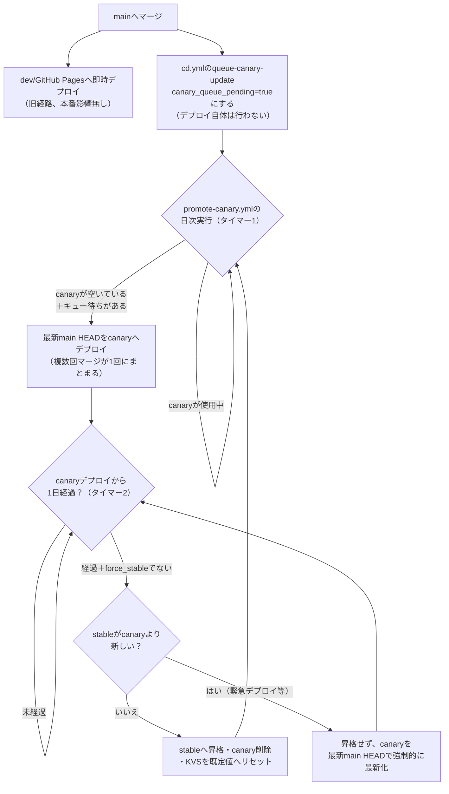

# 単一ステージ運用からstable/canaryへの移行手順

ブルーグリーンデプロイ導入（issue #1319）のTask 4（#1323）として、`backend/serverless.yml`を`stable`/`canary`それぞれ独立したCloudFormationスタックとして並行デプロイできるようにした。本ドキュメントは、現行の単一ステージ運用から新しい構成へ移行する手順を記す。

## 現状

明示的な`--stage`指定無しで`osls deploy`を実行しているため、Serverless Frameworkの既定値であるstage `dev`として稼働している。スタック名は`karuta-app-dev`であり、フロントエンド（`frontend/src/config.js`の`API_BASE_URL`/`WS_BASE_URL`）はこの`dev`ステージのAPI Gateway/WebSocket APIのURLを指している。

## 移行後の構成

`stable`・`canary`という名前のstageで、それぞれ独立したCloudFormationスタック（`karuta-app-stable`・`karuta-app-canary`）を持つ。両スタックとも、DynamoDBテーブル等のステートフルリソース（issue #1320で`serverless-data.yml`へ分離済み）は共有する。`backend/serverless.yml`自体にはコード変更が不要で、`--stage`の値を変えるだけで独立したデプロイ単位になる。

## なぜコード変更が不要か

`backend/serverless.yml`のテーブル名・バケット名（`custom.tableName`等）は固定文字列で、stage名を含まない。IAMポリシー・Lambda関数の環境変数もこれらの固定文字列を直接参照している。そのため、どのstageにデプロイしても同じDynamoDBテーブル・S3バケットを参照する。Lambda関数名・API Gateway自体はServerless Frameworkの既定命名規則（`${service}-${stage}-...`）でstageごとに自動的に分離されるため、`stable`と`canary`は互いに影響しない。

## コミットのライフサイクル（dev→canary→stable、issue #1448・#1449）

mainへのマージから本番反映までの流れと、2つの独立したタイマーの関係を示す。

- **タイマー1（反映頻度、issue #1449）**: mainマージ毎ではなく、`promote-canary.yml`の日次実行時にまとめてcanaryへ反映する。1日に複数回マージされても、canaryへの反映は1日1回にまとまる
- **タイマー2（昇格までの猶予期間、issue #1442）**: canaryへの最新反映（上記）から1日経過し、かつ管理者ロールバック（`force_stable`）が行われていなければstableへ自動昇格する。1週間だった猶予期間を1日へ短縮した
- **詰まりの自動解消（issue #1448）**: 緊急手動デプロイ等でstableがcanaryより新しくなった場合、昇格はスキップされるが、canary自体は強制的に最新化される。これによりタイマー1・2がリセットされ、次のサイクルで正常に進行する

## 移行手順

1. **`stable`・`canary`へ先行デプロイする**（本番トラフィックには影響しない）。`.github/workflows/deploy-backend-stage.yml`を`stage: stable`・`stage: canary`それぞれで手動実行する。
2. **両ステージが独立して動作することを確認する**。各stageの`osls info --stage <stage> --verbose`が出力するAPI Gatewayエンドポイントへ、それぞれ別々にリクエストを送り、正常に応答することを確認する。
3. **両ステージが同一のDynamoDBテーブルを共有していることを確認する**。`.github/workflows/verify-stage-data-sharing.yml`を手動実行する。`stable`経由で投稿したコメントが`canary`経由で読み取れることを確認し、検証用コメントは自動的に削除される。
4. **フロントエンドをstable/canary別のAPIベースURLでビルドできるようにする**（Task 5、issue #1324）。
5. **CDワークフローへ`canary`ステージへの自動デプロイを追加する**（Task 6、issue #1325）。issue本文は「mainへのマージ時はcanaryステージへのみデプロイする」と書かれているが、この時点では`stable`への本番カットオーバー（手順6）がまだ完了していない。既存のdevステージ・GitHub Pagesへの自動デプロイを停止すると、カットオーバーが完了するまで本番がmainの変更を一切受け取れなくなってしまう。この点を実装方針としてユーザーに確認し、既存のdev/GitHub Pagesデプロイはそのまま残し、`canary`ステージへのデプロイを並行して追加する方針を採用した（承認済み）。`stable`ステージは本タスクのデプロイでは一切変更しない。
6. **`stable`への初回切り替え**。フロントエンドの本番ビルド（GitHub Pagesまたは新インフラ、issue #1321参照）が指すAPIエンドポイントを、旧`dev`スタックから新しい`stable`スタックのエンドポイントへ切り替える。この切り替えは本番トラフィックに直接影響するため、実行前に必ずユーザーへ報告し承認を得る。
7. **旧`dev`スタックの削除**。`stable`への切り替えが完全に完了し、問題が無いことを十分な期間確認したのち、`npx osls remove --stage dev`で旧スタックを削除する。DynamoDBテーブル等のステートフルリソースは`serverless-data.yml`側で管理されており、この削除では影響を受けない。

手順6〜7は、それぞれ対応する後続issueが完了してから着手する。現時点（Task 10完了時点）では手順1〜5に加え、手順6の一部（新インフラ側のstable最新化）を実施済み。GitHub Pages（既存の本番、`dev`スタックのAPIを指すビルド）は未変更で、既存ユーザーへの影響は無い。`dev`スタックは引き続き本番として稼働している。

### 補足: CDワークフローのcanaryデプロイ（Task 6）

`cd.yml`へ、既存の`deploy-backend`（devステージ）・`build-and-deploy-frontend`（GitHub Pages）ジョブと並行して以下のジョブを追加した。

- `deploy-backend-canary`: `npx osls deploy --stage canary`。DynamoDBテーブルは全ステージ共有のため、DBシードは`deploy-backend`ジョブの実行で十分であり重複実行しない
- `build-and-deploy-frontend-canary`: `npm run build:canary`のビルド成果物をS3バケットの`canary/`プレフィックス配下へ`aws s3 sync --delete`する。バケットは`infra/serverless.yml`（スタック名`karuta-infra-shared`）で定義したものを使う。対象パスのみCloudFrontキャッシュを無効化する（`DefaultCacheBehavior`が`CachingOptimized`のため、無効化しないと最大24時間反映が遅れる）。

### 補足: フロントエンドのstage別ビルド（Task 5）

`frontend/src/config.js`はもともと`import.meta.env.VITE_API_BASE_URL`/`VITE_WS_BASE_URL`が未設定の場合に`dev`ステージのURLへフォールバックする実装だった。そのため、Viteのmode別envファイル機能で値を切り替えるだけで対応でき、コード変更は不要だった。

- `frontend/.env.stable`・`frontend/.env.canary`: それぞれのステージのAPIベースURL・WebSocketベースURLを定義
- `npm run build:stable` / `npm run build:canary`（`vite build --mode <stage>`）: 対応するビルドを生成
- 既存の`npm run build`（mode未指定）は従来どおり`dev`ステージを指すため、既存のビルドコマンド・CIには影響しない

### 補足: 管理者ロールバック（Task 11）

`.github/workflows/rollback-to-stable.yml`（`workflow_dispatch`）を手動実行すると、KVSの`force_stable`を`true`に設定し、既存の`canary` Cookie保持者も含めて全アクセスを`stable`へ強制的に切り替える。実行にはリポジトリへの書き込み権限とAWS認証情報（Secrets）が必要なため、誰でも実行できるわけではない。

通常運用への復帰（`force_stable`を`false`へ戻す操作）は、誤toggleを避けるため本workflowの対象外とする。Task 12（自動昇格）経由、または必要に応じて別途手動対応する。

### 補足: 1日後の自動昇格（Task 12）

`.github/workflows/promote-canary.yml`（毎日定時実行の`schedule`＋`workflow_dispatch`）が昇格可否を判定する。canaryデプロイから1日経過し、かつ`force_stable`によるロールバックが行われていない場合に、canaryの内容をstableへ自動的に昇格する（猶予期間は当初1週間だったが、issue #1442で1日へ短縮した）。

- 「猶予期間経過」の判定は、専用のタイムスタンプ管理を新設せず、backendのCloudFormationスタック（`karuta-app-canary`）の`LastUpdatedTime`をそのまま使う
- 昇格はbackend（`osls deploy --stage stable`）・frontend（`npm run build:stable`のビルドをS3の`stable/`配下へ同期）の両方を対象とする
- 昇格後、`canary`スタックを`osls remove`で削除し、KVSを既定値（`canary_weight=10`、`force_stable=false`）へリセットする

既知の制約として、昇格時点で既に`canary` Cookieを持つユーザーは、canaryバックエンドスタック削除後もそのエンドポイントへアクセスし続けてしまう可能性がある（最大1週間）。issue #1331の受け入れ基準の対象外のため既知の限界として残す。

### 補足: 緊急時のstable直接デプロイと自動昇格の退行防止（issue #1411・#1448）

本番障害等で`deploy-backend-stage.yml`（`stage: stable`）を緊急手動実行してstableへ直接デプロイした場合、その内容はcanaryを経由していない。この状態で`promote-canary.yml`の自動昇格が発火すると、canaryの古いコード（緊急修正前の内容）でstableが上書きされ、緊急対応した内容が退行してしまう（issue #1407の緊急対応時に実際に発覚した）。

これを防ぐため、昇格可否の判定に「stableの最終更新時刻がcanaryより新しいか」のチェックを追加した。stableがcanaryを追い越している場合、自動昇格は安全側にスキップされる。

当初（issue #1411）はスキップしてJob Summaryへ警告を出すだけだった。この状態を解消する手段が無いため、一度発生すると昇格が永続的にスキップされ続け、キュー待ちの更新も処理されない詰まりが起きた（karuta#1429のUI改善が実際にこの詰まりで本番に反映されない事態が発生した）。issue #1448で、スキップするだけでなく**canaryを最新のmain HEADで強制的に最新化する**よう変更し、詰まりが自動的に解消されるようにした。

### 補足: カナリアへのデプロイの日次バッチ化（issue #1449、#1326を置き換え）

当初（issue #1326）はmainマージ毎に即座にcanaryへデプロイし、既に進行中のカナリアがあればキュー待ちにする方式だった。issue #1449で、canaryへのデプロイをmainマージ毎から日次バッチへ変更した。

- `cd.yml`の`queue-canary-update`ジョブは、mainへのマージ時にKVSの`canary_queue_pending`を`true`にするだけで、canaryへの実デプロイは行わない
- `promote-canary.yml`（毎日定時実行）が、実行ごとに「canaryが空いたか（スタックが存在しない、または`force_stable=true`でロールバック済み）」と「キュー待ちの更新が無いか」を確認する。両方が真であれば最新のmain HEADを新しいcanaryとしてデプロイし、`canary_queue_pending`を`false`へ戻す
- 上記の「stableがcanaryを追い越している」場合（issue #1448）も、この最新化ロジックに統合されており、キュー待ちの有無に関わらず強制的に最新化される

これにより、1日の間に複数回マージされても、canaryへの反映は1日1回にまとまる。

### 補足: sticky Cookie動作のフロントエンド側確認（Task 8）

コード調査の結果、以下の既存設計により両方の受け入れ基準が満たされており、コード変更は不要と判断した。

- **アセット・API呼び出しの一致**: `frontend/src/config.js`の`API_BASE_URL`/`WS_BASE_URL`は`import.meta.env`経由でビルド時に完全に固定される定数であり、実行時に再評価されることは無い。CloudFront Functionsの viewer-request（Task 3）は、Cookieに基づき`/`を含む全リクエストのURIへ同じプレフィックス（`stable`または`canary`）を付与するため、一度割り当てられたユーザーが受け取るHTML・JS・CSSは常に同一ビルドのものになる。APIへのリクエストはCloudFront経由ではなく、そのビルドに埋め込まれた固定URLへ直接送られるため、アセットとAPI呼び出しのバージョンは構造的に一致する
- **Service Workerの古いキャッシュ返却**: `frontend/src/PwaUpdatePrompt.jsx`で`virtual:pwa-register/react`の`useRegisterSW`を使った更新確認UIが既に実装済み。1時間ごとに`registration.update()`を能動実行し、新しいビルド（新しいprecacheマニフェスト）を検知すると「新しいバージョンがあります」の更新案内を表示する（ゲームプレイ中は進行状態保護のため案内のみに留める、issue #1000対応）。`force_stable`によるロールバック（Task 11）等でユーザーの実質的な割り当てが変化した場合も、次回の更新チェック（最大1時間後）で検知され、更新案内が表示される

残存する制約は、この最大1時間の検知ラグのみであり、KVS伝播（最大30秒程度）や自動昇格の判定間隔（1日1回）と同様、既存の許容範囲内の遅延として扱う。実機（ブラウザ・PWAインストール済み端末）での複数セッションにわたる動作確認は、今後の実運用の中で確認する。

### 補足: ErrorBoundary連動の自動フォールバック（Task 9）

issue記載の「`canary` Cookieを削除してから再読み込みする」方式は採用しなかった。当該Cookieが`HttpOnly`属性付き（`infra/serverless.yml`の`ViewerResponseFunction`）であることが実装時に判明したためである。クライアント側JavaScriptからは直接削除・書き換えができない。そのため以下の方式で代替した。

- `shared/ui/ErrorBoundary.jsx`（dev-standards）に汎用的な`fallbackUrl` propを追加し、`componentDidCatch`発生時に自動的に`window.location.href = fallbackUrl`へ遷移するようにした（ボタン操作不要）。karuta側は`frontend/src/main.jsx`で`fallbackUrl="/stable${検索クエリ}"`を指定する
- `ViewerRequestFunction`（CloudFront Functions）を変更し、`/stable/`への明示アクセス時に`NEW_ASSIGNMENT_HEADER`を`stable`固定で設定するようにした。既存の`ViewerResponseFunction`がこれを受けて`canary=stable`のCookieを発行するため、単なる再抽選ではなく確実にstableへ固定される

`.github/workflows/verify-stable-fallback.yml`（`workflow_dispatch`）で、実デプロイ済みのCloudFront URLを対象に自動検証する。検証内容は「`/stable/`への明示アクセスが常にstableの内容を返すこと」と「`/stable/`アクセス後、以後のCookie無し通常アクセスもstableへ固定されること」の2点である。ErrorBoundary自体の自動遷移ロジック（JS側の挙動）はブラウザでのみ確認可能なため対象外とし、単体テストで検証した。

### 補足: canaryスタックが存在しない状態での/canary/明示アクセス対策（issue #1489）

上記のErrorBoundaryによる自動フォールバックは、canaryアプリ自体が起動した後にエラーが起きた場合にのみ機能する。canaryスタック自体が存在しない状態（昇格直後でまだ新規canaryが作られていない等）で`/canary/`へ明示アクセスすると、S3に対応するオブジェクトが無く`index.html`自体を取得できないため、ErrorBoundaryが発火する前に白画面になってしまう。

この対策として、KVSに`canary_exists`キーを新設した。`promote-canary.yml`がcanaryのデプロイ・削除に合わせて更新する（デプロイ成功時に`true`、削除時に`false`）。`ViewerRequestFunction`は`/canary/`への明示アクセス時にこのキーを確認し、`true`でなければ`/stable/`への明示アクセスと同様に扱う（stableへ読み替え、以後の通常アクセスも`stable` Cookieで固定する）。

### 補足: 手動切り替えリンク（Task 10）

ErrorBoundaryが検知できない軽微な不具合（クラッシュに至らない表示崩れ等）向けに、`frontend/src/components/StableSwitchLink.jsx`をフッターへ追加した。`import.meta.env.MODE`が`canary`のビルドでのみ表示し、クリックすると`/stable${検索クエリ}`へ遷移する。Task 9で追加した`ViewerRequestFunction`側のstable固定ロジックをそのまま再利用するため、CloudFront Functions側の追加変更は不要だった。

### 補足: stableへの初回切り替え（手順6、新インフラ側のみ実施）

Task 1〜12が完了した時点でも、`promote-canary.yml`（週次の自動昇格）は未発火（canaryデプロイから1週間未経過）のままだった。そのため、新インフラ（CloudFront）側の`stable`プレフィックス・`karuta-app-stable`スタックは、Task 4で初回デプロイした時点の古いコードのままだった。Task 13（旧URLの移行ページ化）着手の前提として、新URL（CloudFront）が実際に最新コードで機能している状態を整える必要がある。

`promote-canary.yml`の昇格処理はそのまま流用できない（`canary`スタックの削除・KVSリセットまで実行されてしまい、進行中の検証に影響するため）。そのため、以下を個別に手動実行した。

- `.github/workflows/deploy-backend-stage.yml`（`stage: stable`）: `karuta-app-stable`スタックを現在の`main` HEADの内容で再デプロイ
- `.github/workflows/deploy-frontend-stage.yml`（新規、`stage: stable`）: S3の`stable/`プレフィックスを現在の`main` HEADのビルドで再デプロイ。`promote-canary.yml`・`cd.yml`の`canary`向けデプロイ処理から、プレフィックス単体更新用のロジックのみを抜き出した新規workflow

**GitHub Pages（既存の本番、`dev`スタックのAPIを指すビルド）は本作業で一切変更していない**。新インフラのCloudFront既定ドメイン経由でのみ影響があり、既存ユーザー（GitHub Pages経由）への影響は無い。

### 補足: 旧URL（GitHub Pages）の移行ページ（Task 13）

`github-pages-migration/`配下に、`vite-plugin-pwa`等のビルドパイプラインを通さないビルドレスの静的ページ（`index.html`・`sw.js`）を新設した。`cd.yml`の`build-and-deploy-frontend`ジョブを、既存のReactアプリ（`frontend/dist`）のビルド・デプロイから、この移行ページのデプロイへ切り替えた。これにより、以後`main`へマージするたびにGitHub Pagesへ配信される内容が移行ページで固定される。

- `index.html`: ページ読み込み時に`navigator.serviceWorker.getRegistrations()`→`unregister()`、`caches.keys()`→`caches.delete()`を実行し、新URL（CloudFront既定ドメイン）へ自動的にリダイレクトする。新URLはビルド時の固定値ではなくデプロイ時にCloudFormation出力から解決するため、`sed`でプレースホルダー（`__NEW_URL__`）を実際のドメインへ置換する`build-command`を`deploy-github-pages`複合actionへ渡している
- `sw.js`: kill switch用のService Worker。既存のvite-plugin-pwa生成SW（Workbox）が`index.html`をprecache済みのため、通常のページロードではナビゲーションリクエストがSWのfetchハンドラでインターセプトされてしまう。その結果、移行ページのインラインスクリプトが実行される前に、古いアプリの内容がキャッシュから返ってしまう可能性がある。ブラウザはページロード時にSWスクリプト自体の更新確認を行う仕様のため、このファイルへの差し替えが検出されると、`install`時に`skipWaiting()`で即座に新SWへ切り替わる。`activate`時には全キャッシュ削除・SW自身の`unregister()`・開いているタブの`navigate()`（リロード）を行う。リロード後はSWが存在しないため、移行ページのインラインスクリプトが確実に実行される（PWAとしてインストール済みの端末でも、初回アクセス時に一度リロードが入る形で新URLへ到達する）

## 関連issue

- #1319（親issue）
- #1320（データ層分離。本移行の前提）
- #1321, #1322（S3+CloudFrontインフラ・CloudFront Functions重み付けルーティング）
- #1324（Task 5、フロントエンドstage別APIベースURL）
- #1325（Task 6、CDワークフローのcanaryデプロイフロー新設）
- #1326（Task 7、カナリアの直列化。#1449で置き換え）
- #1327（Task 8、sticky Cookie動作のフロントエンド側確認）
- #1328（Task 9、ErrorBoundary連動の自動フォールバック）
- #1329（Task 10、手動切り替えリンク）
- #1330（Task 11、管理者ロールバック）
- #1331（Task 12、自動昇格）
- #1332（Task 13、旧URL(GitHub Pages)の移行ページ）
- #1411（stableがcanaryを追い越している場合の昇格スキップ）
- #1442（自動昇格の猶予期間を1週間から1日へ短縮）
- #1448（詰まり解消: canaryを自動で最新化する）
- #1449（canaryへのデプロイを日次バッチ化、#1326を置き換え）
