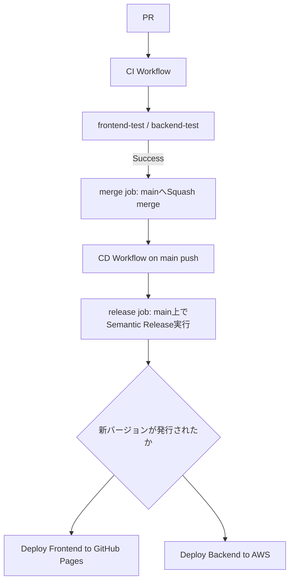

# CI/CD Pipeline Specification（karuta固有）

本プロジェクトの CI/CD は [dev-standards の共通パイプライン仕様](../dev-standards/docs/cicd-pipeline-specification.md)（`reusable-ci.yml` / `reusable-cd.yml`）をベースに構築されている。

ワークフローの共通ジョブ構成およびリリース運用については上記ドキュメントを参照すること。本ドキュメントには karuta 固有の内容のみを記載する。

## Architecture

<details>
<summary>ソースを表示（mermaid記法）</summary>



上記の```mermaid```ブロックはPR差分ビュー・API経由でのファイル取得等ではテキストのまま表示され図として確認できない（[bamiyanapp/karuta#824](https://github.com/bamiyanapp/karuta/issues/824)）。ソース（mermaid記法）はこのまま維持しつつ、下記は`enable_mermaid_render` job（[dev-standards側ドキュメント](../dev-standards/docs/cicd-pipeline-specification.md#1-ci-ワークフロー-reusable-ciyml)参照）が`main`へのマージのたびに再レンダリングし、`docs-diagrams`ブランチの`latest/`へ上書き公開している画像（常に最新版）。

</details>


semantic-releaseの実行は`main`へのpush後（CD側の`release`ジョブ）で行われる。以前はPRの作業ブランチ上でマージ前に実行する方式だったが、GitHub Actionsの`pull_request`イベントで自動設定される`GITHUB_REF`（ワークフローYAMLの`env:`では上書き不可）により常にリリースが発行されない不具合があったため、`main`への実pushイベント上で実行する方式に修正した（[dev-standards#43](https://github.com/bamiyanapp/dev-standards/pull/43)）。

karutaの`main`は「変更は必ずPR経由」のリポジトリルールで保護されているため、`release`ジョブによる`main`への直接pushはそのままではGH013エラーで拒否される。この問題に対応するため、直接pushが失敗した場合はローカルに作成済みのリリースコミットを新しいブランチへpushし、`main`へのPRを作成してAPI経由でsquash mergeするフォールバックが追加されている（[dev-standards#44](https://github.com/bamiyanapp/dev-standards/pull/44)、タグ名の導出方法の修正が[dev-standards#45](https://github.com/bamiyanapp/dev-standards/pull/45)、GitHub Release作成の冪等化が[dev-standards#46](https://github.com/bamiyanapp/dev-standards/pull/46)）。karuta運用者が意識する必要がある手順の違いはなく、`release`ジョブの結果として`new_release_published`が正しく出力されればデプロイジョブは通常どおり実行される。詳細は[dev-standards側ドキュメント](../dev-standards/docs/cicd-pipeline-specification.md#4-リリース運用)を参照。

## E2Eテスト（`ci.yml` 固有）

`frontend-e2e-test`ジョブ（共通、dev-standardsの`reusable-ci.yml`）は`enable_e2e_test: true`で有効化している（Playwright、`frontend/e2e/`配下）。

このリポジトリにはE2E専用のモックバックエンドが存在しないため、**E2Eテストは実際にデプロイ済みの本番相当AWS環境（`frontend/src/config.js`のAPI_BASE_URL/WS_BASE_URLが指すAPI Gateway・DynamoDB・WebSocket API）に対して実行する**。CI実行のたびに実際のクイズ大会モードのルームが作成されるが、ルームはDynamoDBのTTLにより24時間で自動失効するため、テスト実行のたびに残骸が蓄積し続けることはない。

### JSカバレッジのログ出力（issue #541）

E2Eテスト実行中に読み込まれたJS（フロントエンドのビルド成果物のみ、Chromiumの`page.coverage`APIで計測）のカバレッジを`monocart-reporter`（`frontend/playwright.config.js`のreporter設定、`frontend/e2e/coverage.js`のヘルパー経由で各テストが呼び出す）で収集し、`frontend/coverage/coverage-summary.json`へ`frontend-test`ジョブのユニットテストカバレッジと同じ形式で出力する。`frontend-e2e-test`ジョブ側で`check-coverage-threshold`複合アクション（dev-standards）をthreshold未指定（表示のみ）で再利用し、Job Summary・ログへ表示する。閾値によるゲートは現時点では行っていない（要否は別途検討）。カバレッジ算出には`vite.config.js`の`build.sourcemap: true`が必要（ビルド成果物を元のソースファイル単位へマッピングするため）。

### スクリーンショットの公開（issue #568）

`frontend/e2e/screenshot.js`の`captureScreenshot()`が、`testInfo.attach()`によるPlaywright HTMLレポートへの添付に加えて、`frontend/e2e-screenshots/`へPNGファイルとしても書き出す。GitHub Actionsのアーティファクト（zip）はダウンロード・展開が必要で特にスマホ版GitHubアプリからは閲覧が難しいため、`frontend-e2e-test`ジョブ側（dev-standardsの`reusable-ci.yml`）で以下を行い、画像を直接埋め込んだ形で確認できるようにしている。

1. `peaceiris/actions-gh-pages`で`frontend/e2e-screenshots/`配下のPNGを専用ブランチ`e2e-screenshots`（`runs/<run_id>/`配下、過去の実行分は`keep_files: true`で保持）へ公開する
2. `raw.githubusercontent.com`のURLとして、Job Summaryへ画像を埋め込む
3. `pull_request`イベントの場合は、同じ内容をPRコメントとしても投稿する（GitHubのモバイルアプリでもネイティブに画像が表示される）

これらはいずれも補助的な機能であり、失敗してもE2Eテスト自体の成功/失敗判定には影響しない（各ステップに`continue-on-error: true`を付けている）。`e2e-screenshots`ブランチは実行のたびに蓄積されるため、リポジトリ肥大化への対応（古い実行分の定期削除等）は必要になった時点で別途検討する。

## 有効化・無効化しているジョブ（`ci.yml` 固有、issue #461）

`reusable-ci.yml`が提供する任意ジョブのうち、karutaでは以下のように設定している。

| ジョブ | 設定 | 理由 |
|---|---|---|
| `frontend-e2e-test` | `enable_e2e_test: true`（有効） | 上記「E2Eテスト」節を参照 |
| `standards-check` | `enable_standards_check: true`（有効） | dev-standardsサブモジュールの`sync-manifest.json`に基づき、symlinkの欠落・リンク切れ・`.gitignore`等コピー対象ファイルの内容乾離を検知する。`node dev-standards/scripts/bootstrap.js --check`を実行する |
| `package-test` | 未指定（無効、デフォルトのまま） | `inputs.packages`（frontend/backend以外の小さなパッケージをmatrix展開する仕組み）向けで、karutaは`frontend_dir`/`backend_dir`による固定2パッケージ構成のため対象がなく不要。パッケージ構成が増えた場合に改めて検討する |
| カバレッジ閾値ゲート（`frontend-test`/`backend-test`共通） | `coverage_threshold: 80`・`coverage_metrics: "branches"`・`coverage_check_per_file: true`（有効、issue #459） | 分岐(branches)カバレッジを基準に80%を必須化し、パッケージ全体平均だけでなくファイル単位でも80%を必須化する。一部ファイルのカバレッジが著しく低くても全体平均でクリアしてしまう問題（issue #459）に対応するため、`coverage_check_per_file: true`をあわせて指定している。カバレッジ表自体は常に4指標（statements/branches/functions/lines）を表示し、ゲート判定のみ`branches`に絞り込む。前提となる`check-coverage-threshold`複合アクションのファイル単位判定・指標絞り込み対応は[dev-standards#57](https://github.com/bamiyanapp/dev-standards/issues/57)で実装済み |

### `.gitignore`の同期について

ルートの`.gitignore`は`standards-check`の`copies`対象（dev-standards側と内容が完全一致している必要がある）。GitHubの制約上symlinkにできないため、dev-standards側の`.gitignore`が更新された場合はこのファイルを手動で同期する必要がある。

**プロジェクト固有のignoreルールはルートの`.gitignore`に追加せず、`frontend/.gitignore`・`backend/.gitignore`等、対象ディレクトリのgitignoreに追加すること**（gitのネストされた`.gitignore`は親ディレクトリのルールより優先されるため、`!`による打ち消しも問題なく機能する）。ルートに直接追記すると`standards-check`が内容乾離として検知し、CIが失敗する（issue #461で実際に`!.env.example`がルートに直接追記されており、これが原因でCIが失敗する状態になっていたため、`frontend/.gitignore`側へ移設した）。

## CodeQLワークフロー（`codeql.yml`固有、issue #808）

`.github/workflows/codeql.yml`（karuta固有、`reusable-ci.yml`/`reusable-cd.yml`とは別のトップレベルワークフローファイル）から dev-standards の `reusable-codeql.yml` を呼び出し、frontend/backend（いずれもJavaScript）を対象にCodeQLによる静的解析を行う。結果はGitHub Securityタブへ表示され、スマートフォンのブラウザからも閲覧できる（「開発環境の制約（スマホオンリー）」参照）。

- **トリガー**: `push`（`main`）・`pull_request`・`schedule`（毎週月曜日 03:00 UTC）。`schedule`はコード変更が無い期間もCodeQLのクエリセット更新を検知するために設定している
- **`reusable-ci.yml`との関係**: 独立したワークフローであり、`merge` jobのマージ可否ゲートには関与しない。必須チェックにするかどうかはリポジトリのブランチ保護設定側で判断する（本ドキュメント作成時点では未設定）

## デプロイジョブ（`cd.yml` 固有）

`release` ジョブ（共通、dev-standards の `reusable-cd.yml`）の成功後、`needs.release.outputs.new_release_published == 'true'` の場合のみ以下を実行する。

- `build-and-deploy-frontend`: frontend をビルドし、GitHub Pages へデプロイ
- `deploy-backend`: backend を Serverless Framework（CLIはSaaSサインイン不要なOSSフォーク[osls](https://github.com/oss-serverless/serverless)、issue #611）を使用して AWS Lambda へデプロイし、`seed.js` でシードを実行する

## 環境変数（karuta固有）

共通の `GITHUB_TOKEN` / `BOT_TOKEN`（[dev-standards参照](../dev-standards/docs/cicd-pipeline-specification.md#共通の環境変数)）に加え、以下を使用する。

| 変数名 | 説明 | 例 |
|---|---|---|
| `AWS_ACCESS_KEY_ID` | AWSアカウントへのアクセスキーID | `AKI*****************` |
| `AWS_SECRET_ACCESS_KEY` | AWSアカウントへのシークレットアクセスキー | `****************************************` |
