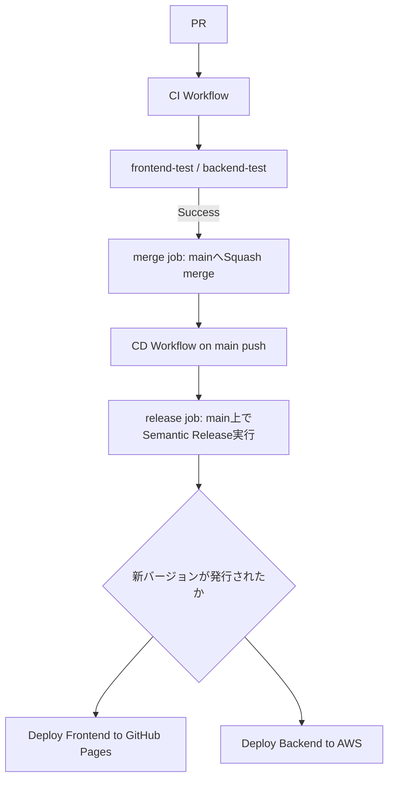

# CI/CD Pipeline Specification（karuta固有）

本プロジェクトの CI/CD は [dev-standards の共通パイプライン仕様](../dev-standards/docs/cicd-pipeline-specification.md)（`reusable-ci.yml` / `reusable-cd.yml`）をベースに構築されている。

ワークフローの共通ジョブ構成およびリリース運用については上記ドキュメントを参照すること。本ドキュメントには karuta 固有の内容のみを記載する。

## Architecture

semantic-releaseの実行は`main`へのpush後（CD側の`release`ジョブ）で行われる。以前はPRの作業ブランチ上でマージ前に実行する方式だったが、GitHub Actionsの`pull_request`イベントで自動設定される`GITHUB_REF`（ワークフローYAMLの`env:`では上書き不可）により常にリリースが発行されない不具合があったため、`main`への実pushイベント上で実行する方式に修正した（[dev-standards#43](https://github.com/bamiyanapp/dev-standards/pull/43)）。

karutaの`main`は「変更は必ずPR経由」のリポジトリルールで保護されているため、`release`ジョブによる`main`への直接pushはそのままではGH013エラーで拒否される。この問題に対応するため、直接pushが失敗した場合はローカルに作成済みのリリースコミットを新しいブランチへpushし、`main`へのPRを作成してAPI経由でsquash mergeするフォールバックが追加されている（[dev-standards#44](https://github.com/bamiyanapp/dev-standards/pull/44)、タグ名の導出方法の修正が[dev-standards#45](https://github.com/bamiyanapp/dev-standards/pull/45)、GitHub Release作成の冪等化が[dev-standards#46](https://github.com/bamiyanapp/dev-standards/pull/46)）。karuta運用者が意識する必要がある手順の違いはなく、`release`ジョブの結果として`new_release_published`が正しく出力されればデプロイジョブは通常どおり実行される。詳細は[dev-standards側ドキュメント](../dev-standards/docs/cicd-pipeline-specification.md#3-リリース運用)を参照。

## E2Eテスト（`ci.yml` 固有）

`frontend-e2e-test`ジョブ（共通、dev-standardsの`reusable-ci.yml`）は`enable_e2e_test: true`で有効化している（Playwright、`frontend/e2e/`配下）。

このリポジトリにはE2E専用のモックバックエンドが存在しないため、**E2Eテストは実際にデプロイ済みの本番相当AWS環境（`frontend/src/config.js`のAPI_BASE_URL/WS_BASE_URLが指すAPI Gateway・DynamoDB・WebSocket API）に対して実行する**。CI実行のたびに実際のクイズ大会モードのルームが作成されるが、ルームはDynamoDBのTTLにより24時間で自動失効するため、テスト実行のたびに残骸が蓄積し続けることはない。

## 有効化・無効化しているジョブ（`ci.yml` 固有、issue #461）

`reusable-ci.yml`が提供する任意ジョブのうち、karutaでは以下のように設定している。

| ジョブ | 設定 | 理由 |
|---|---|---|
| `frontend-e2e-test` | `enable_e2e_test: true`（有効） | 上記「E2Eテスト」節を参照 |
| `standards-check` | `enable_standards_check: true`（有効） | dev-standardsサブモジュールの`sync-manifest.json`に基づき、symlinkの欠落・リンク切れ・`.gitignore`等コピー対象ファイルの内容乾離を検知する。`node dev-standards/scripts/bootstrap.js --check`を実行する |
| `package-test` | 未指定（無効、デフォルトのまま） | `inputs.packages`（frontend/backend以外の小さなパッケージをmatrix展開する仕組み）向けで、karutaは`frontend_dir`/`backend_dir`による固定2パッケージ構成のため対象がなく不要。パッケージ構成が増えた場合に改めて検討する |

### `.gitignore`の同期について

ルートの`.gitignore`は`standards-check`の`copies`対象（dev-standards側と内容が完全一致している必要がある）。GitHubの制約上symlinkにできないため、dev-standards側の`.gitignore`が更新された場合はこのファイルを手動で同期する必要がある。

**プロジェクト固有のignoreルールはルートの`.gitignore`に追加せず、`frontend/.gitignore`・`backend/.gitignore`等、対象ディレクトリのgitignoreに追加すること**（gitのネストされた`.gitignore`は親ディレクトリのルールより優先されるため、`!`による打ち消しも問題なく機能する）。ルートに直接追記すると`standards-check`が内容乾離として検知し、CIが失敗する（issue #461で実際に`!.env.example`がルートに直接追記されており、これが原因でCIが失敗する状態になっていたため、`frontend/.gitignore`側へ移設した）。

## デプロイジョブ（`cd.yml` 固有）

`release` ジョブ（共通、dev-standards の `reusable-cd.yml`）の成功後、`needs.release.outputs.new_release_published == 'true'` の場合のみ以下を実行する。

- `build-and-deploy-frontend`: frontend をビルドし、GitHub Pages へデプロイ
- `deploy-backend`: backend を Serverless Framework を使用して AWS Lambda へデプロイし、`seed.js` でシードを実行する

## 環境変数（karuta固有）

共通の `GITHUB_TOKEN` / `BOT_TOKEN`（[dev-standards参照](../dev-standards/docs/cicd-pipeline-specification.md#共通の環境変数)）に加え、以下を使用する。

| 変数名 | 説明 | 例 |
|---|---|---|
| `AWS_ACCESS_KEY_ID` | AWSアカウントへのアクセスキーID | `AKI*****************` |
| `AWS_SECRET_ACCESS_KEY` | AWSアカウントへのシークレットアクセスキー | `****************************************` |
