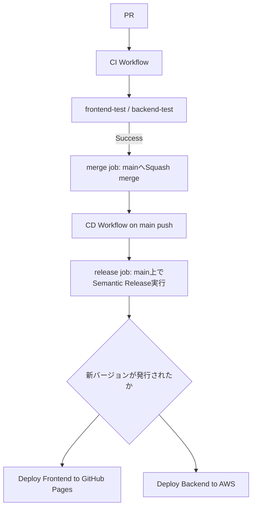

# CI/CD Pipeline Specification（karuta固有）

本プロジェクトの CI/CD は [dev-standards の共通パイプライン仕様](../dev-standards/docs/cicd-pipeline-specification.md)（`reusable-ci.yml` / `reusable-cd.yml`）をベースに構築されている。

ワークフローの共通ジョブ構成およびリリース運用については上記ドキュメントを参照すること。本ドキュメントには karuta 固有の内容のみを記載する。

## Architecture

semantic-releaseの実行は`main`へのpush後（CD側の`release`ジョブ）で行われる。以前はPRの作業ブランチ上でマージ前に実行する方式だったが、GitHub Actionsの`pull_request`イベントで自動設定される`GITHUB_REF`（ワークフローYAMLの`env:`では上書き不可）により常にリリースが発行されない不具合があったため、`main`への実pushイベント上で実行する方式に修正した（[dev-standards#43](https://github.com/bamiyanapp/dev-standards/pull/43)）。詳細は[dev-standards側ドキュメント](../dev-standards/docs/cicd-pipeline-specification.md)を参照。

## デプロイジョブ（`cd.yml` 固有）

`release` ジョブ（共通、dev-standards の `reusable-cd.yml`）の成功後、`needs.release.outputs.new_release_published == 'true'` の場合のみ以下を実行する。

- `build-and-deploy-frontend`: frontend をビルドし、GitHub Pages へデプロイ
- `deploy-backend`: backend を Serverless Framework を使用して AWS Lambda へデプロイし、`seed.js` でシードを実行する

## 環境変数（karuta固有）

共通の `GITHUB_TOKEN` / `BOT_TOKEN`（[dev-standards参照](../dev-standards/docs/cicd-pipeline-specification.md#共通の環境変数)）に加え、以下を使用する。

| 変数名 | 説明 | 例 |
|---|---|---|
| `AWS_ACCESS_KEY_ID` | AWSアカウントへのアクセスキーID | `AKI*****************` |
| `AWS_SECRET_ACCESS_KEY` | AWSアカウントへのシークレットアクセスキー | `****************************************` |
