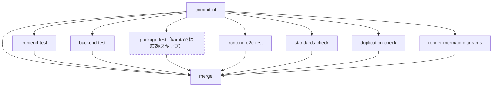
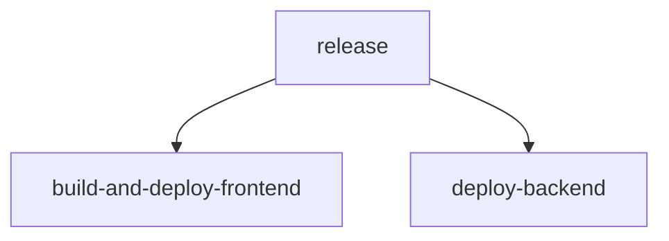

# CI/CD構成図（自動生成）

このファイルはdev-standardsの`reusable-ci.yml`のjob定義と、karuta自身の`.github/workflows/ci.yml`/`cd.yml`から`scripts/docs/generate-cicd-architecture.js`によって自動生成される。手動で編集しないこと。再生成するには`node scripts/docs/generate-cicd-architecture.js`を実行する（[issue #905](https://github.com/bamiyanapp/karuta/issues/905)）。

job間の依存（`needs:`）およびkarutaの実際の設定（`ci.yml`の`with:`）に基づく有効/無効の判定は静的解析で抽出しているが、dev-standards submoduleの参照バージョンが更新されるとjob構成自体が変わりうる点に留意する。

## CIワークフロー（reusable-ci.yml、karuta設定反映）

## CDワークフロー（karuta cd.yml）

