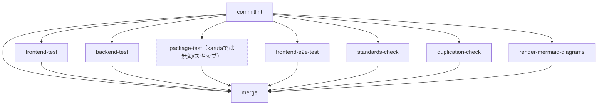
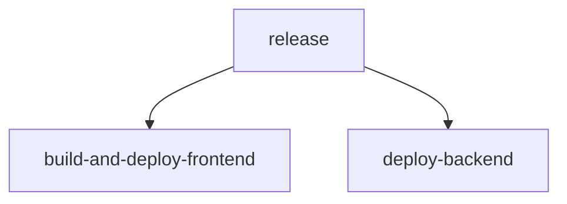

# CI/CD構成図（自動生成）

このファイルはdev-standardsの`reusable-ci.yml`のjob定義と、karuta自身の`.github/workflows/ci.yml`/`cd.yml`から`scripts/docs/generate-cicd-architecture.js`によって自動生成される。手動で編集しないこと。再生成するには`node scripts/docs/generate-cicd-architecture.js`を実行する（[issue #905](https://github.com/bamiyanapp/karuta/issues/905)）。

job間の依存（`needs:`）およびkarutaの実際の設定（`ci.yml`の`with:`）に基づく有効/無効の判定は静的解析で抽出しているが、dev-standards submoduleの参照バージョンが更新されるとjob構成自体が変わりうる点に留意する。

## CIワークフロー（reusable-ci.yml、karuta設定反映）

<details>
<summary>ソースを表示（mermaid記法）</summary>



上記の```mermaid```ブロックはPR差分ビュー・API経由でのファイル取得等ではテキストのまま表示され図として確認できない（[#824](https://github.com/bamiyanapp/karuta/issues/824)）。ソースはこのまま維持しつつ、下記は`enable_mermaid_render` job（[docs/cicd-pipeline-specification.md](../cicd-pipeline-specification.md)参照）が`main`へのマージのたびに再レンダリングし、`docs-diagrams`ブランチの`latest/`へ上書き公開している画像（常に最新版）。

</details>


## CDワークフロー（karuta cd.yml）

<details>
<summary>ソースを表示（mermaid記法）</summary>



上記の```mermaid```ブロックはPR差分ビュー・API経由でのファイル取得等ではテキストのまま表示され図として確認できない（[#824](https://github.com/bamiyanapp/karuta/issues/824)）。ソースはこのまま維持しつつ、下記は`enable_mermaid_render` job（[docs/cicd-pipeline-specification.md](../cicd-pipeline-specification.md)参照）が`main`へのマージのたびに再レンダリングし、`docs-diagrams`ブランチの`latest/`へ上書き公開している画像（常に最新版）。

</details>


